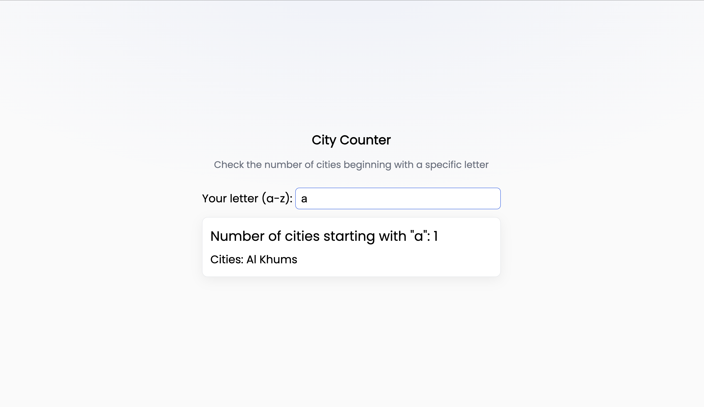

# City Counter App

This app lets users enter a letter and returns the number of cities (from OpenWeatherMap sample data) that start with that letter.

## Tech Stack

This is `pnpm` managed monorepo - you need `pnpm` to run it properly. See "Running the App" section for more details.

- **Frontend**: React + Vite + TypeScript
- **Backend**: Node.js + TypeScript

`Typescript` is used on backend and frontend side for better type handling.

---

## Running the App

1. Make sure `pnmp` package manager is installed - see instructions eg. https://pnpm.io/installation
2. Run `pnpm i` to install dependencies
3. Run `pnpm dev` to run `server` and `frontend` application
4. You can run apps separately by using `filter` flag eg. `pnpm --filter @vandeley/frontend dev` or `pnpm --filter @vandeley/frontend dev`
5. To build project use `pnpm build` command - see next section

## Building the application

When running `pnpm build` command both applications will write the output to:

- `backend/bin`
- `frontend/dist`

directories.

Use the output files for deployment.

---

## More details

### Backend

Backend is using `node` v. `22.15.0` (see `.nvmrc` file for specified version). Server is running on port `3000`.

#### Endpoints

`GET /api/v1/cities` endpoint expects `letter` param as input.

Response:

- `count` is number of cities that starts with provided `letter`,
- `cities` is the array of cities objects with `name` property.

example response:

```json
{
    "cities":
        [
            {
                "name": "Al Khums"
            }
        ],
    "count": 1
}
```

### Frontend

Frontend is using `React` as library and `vite` as bundler. App is running on port `5173` in dev mode with dev server.



### Code quality

ESlint and Prettier are installed for better code quality management.

Please use `pnmp lint` and `pnmp format` commands when contributing.
